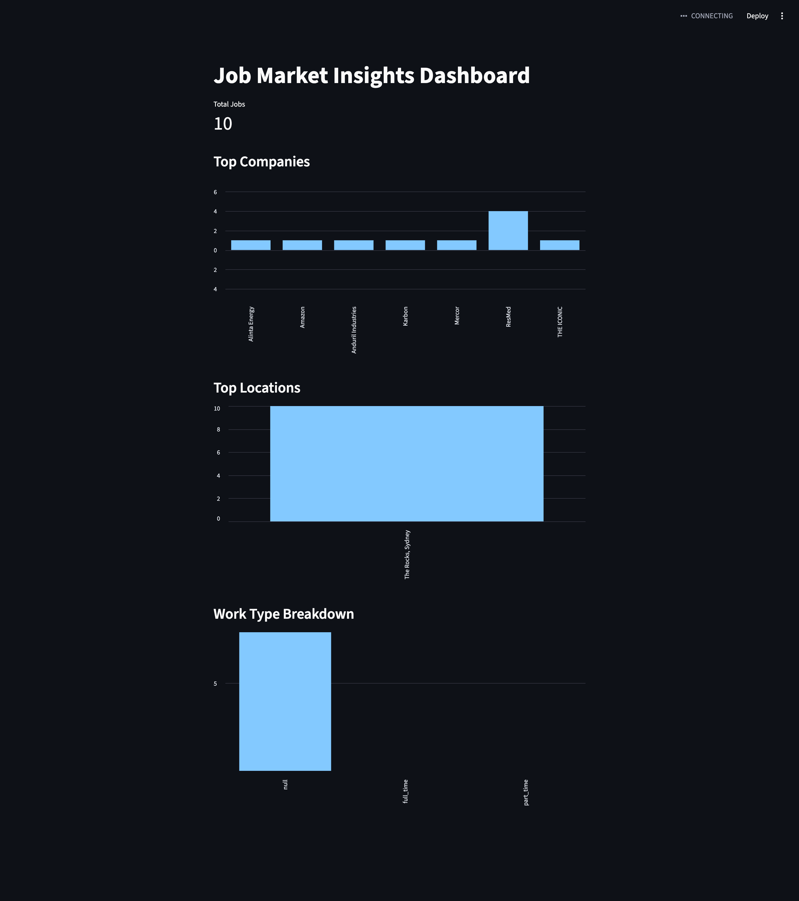
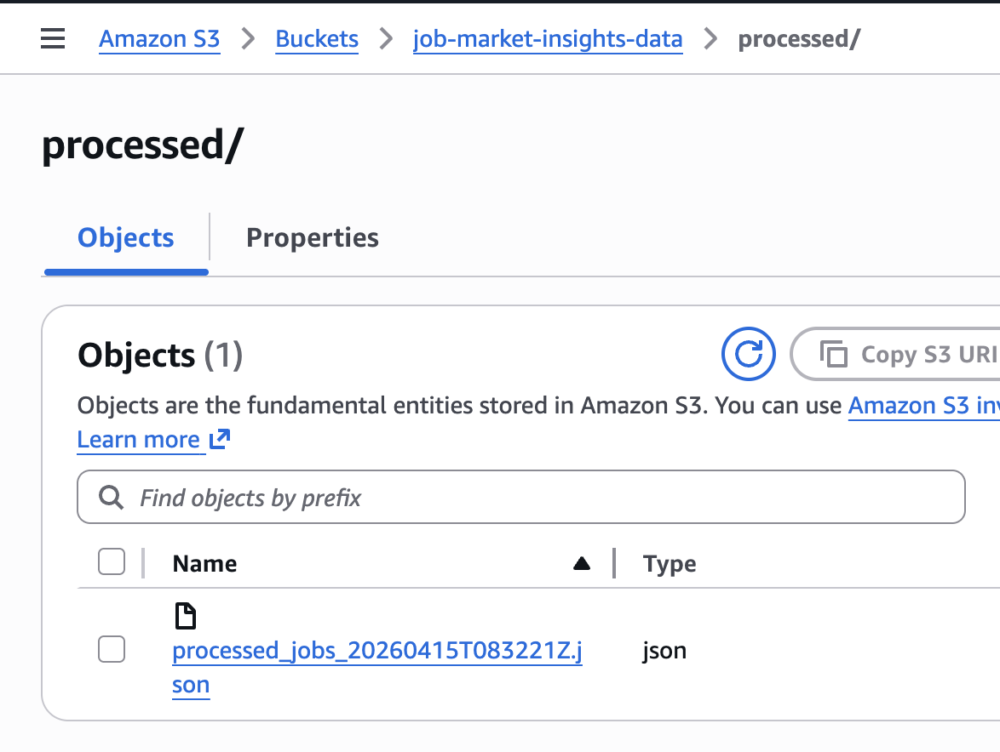
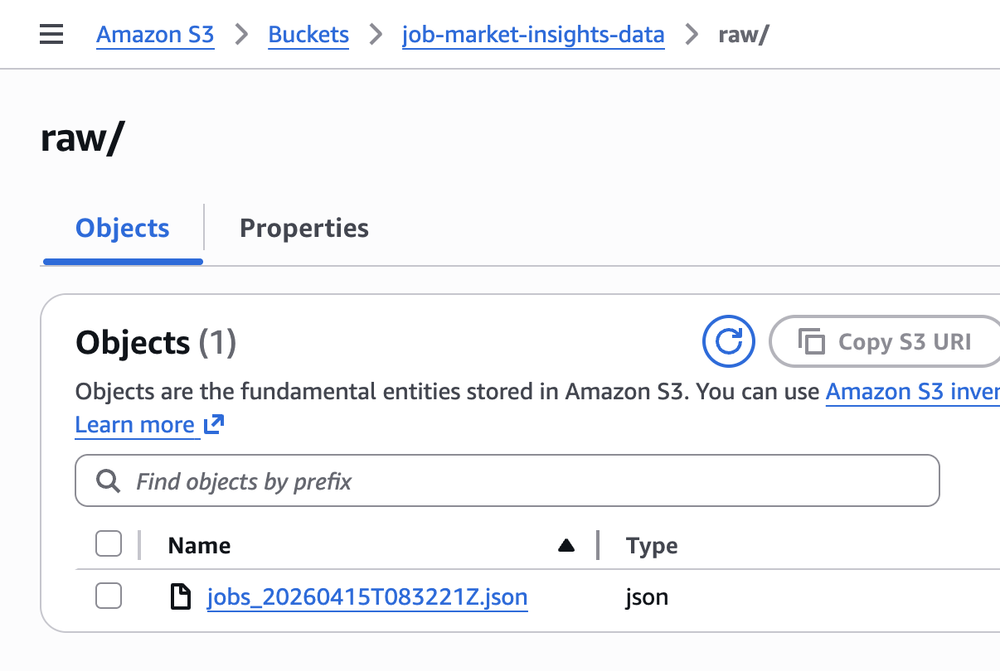
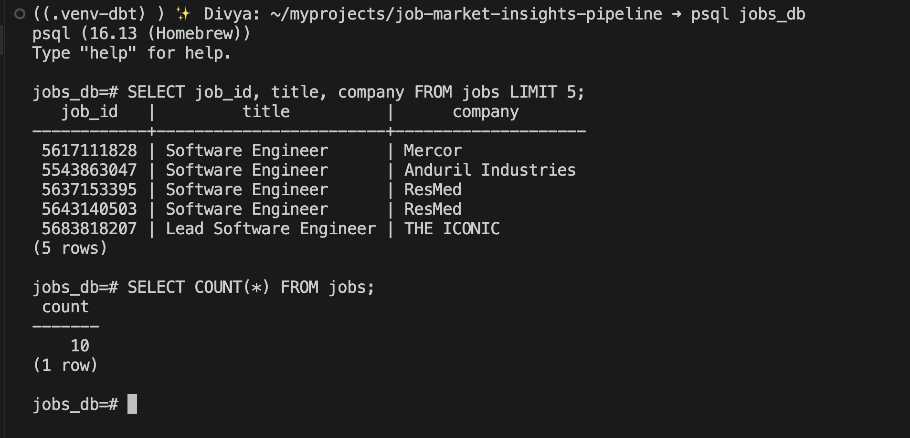
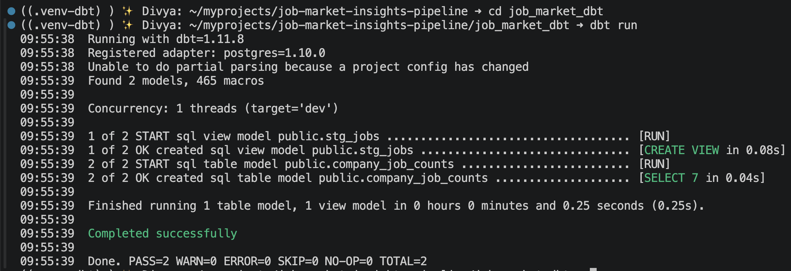
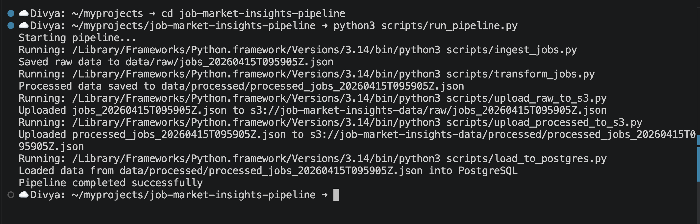

# Job Market Insights Pipeline

## Overview
This project builds an end-to-end data pipeline to collect, process, store, and visualize job market data.

The pipeline ingests job listings from the Adzuna API, processes and stores them in PostgreSQL, transforms the data using dbt, and presents insights through an interactive Streamlit dashboard.

---

## Architecture

Adzuna API  
→ Raw Data (JSON)  
→ Data Transformation  
→ S3 (raw + processed)  
→ PostgreSQL (data warehouse)  
→ dbt (staging + marts)  
→ Streamlit Dashboard  

---

## Tech Stack

- Python  
- AWS S3  
- PostgreSQL  
- dbt  
- Streamlit  
- GitHub Actions  

---

## Features

- Automated data ingestion from external API  
- Data transformation and schema standardization  
- Storage of raw and processed data in S3  
- Loading structured data into PostgreSQL  
- Data modeling using dbt (staging + marts)  
- Interactive dashboard for job market insights  
- End-to-end pipeline execution with a single script  

---

## Sample Insights

- Total number of job listings  
- Top hiring companies  
- Top job locations  
- Work type distribution (full-time, part-time, etc.)  

---

## Project Structure

job-market-insights-pipeline/

scripts/
- ingest_jobs.py
- transform_jobs.py
- upload_raw_to_s3.py
- upload_processed_to_s3.py
- load_to_postgres.py
- run_pipeline.py

data/
- raw/
- processed/

job_market_dbt/
- models/
  - staging/
  - marts/

dashboard/
- app.py

docs/
warehouse/
requirements.txt

---

## How to Run

### 1. Set environment variables

```bash
export ADZUNA_APP_ID="your_app_id"
export ADZUNA_APP_KEY="your_app_key"
```
```bash
export DB_HOST=localhost
export DB_NAME=jobs_db
export DB_USER=your_username
export DB_PASSWORD=
```
---

### 2. Run full pipeline

```bash
python3 scripts/run_pipeline.py
```
---

### 3. Run dbt models

```bash
cd job_market_dbt
dbt run
```
---

### 4. Run dashboard
```bash
streamlit run dashboard/app.py
```
---

## Future Improvements

- Deploy PostgreSQL on AWS RDS  
- Automate pipeline with scheduled workflows  
- Enhance dbt models with additional analytics  
- Deploy dashboard to production environment  

## Screenshots

### Dashboard
<p align="center">
  
</p>

### S3 Storage

<p align="center">
  
</p>
<p align="center">
  
</p>

### PostgreSQL Data

<p align="center">
  
</p>

### dbt Models

<p align="center">
  
</p>

### Pipeline
<p align="center">
  
</p>
